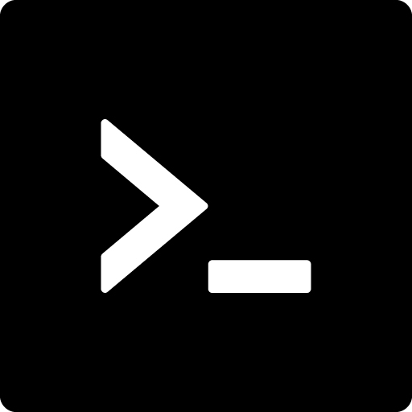

<!--
  CAUTION: This file is automatically generated. Do not edit it manually!
  To adjust it, change the sdk-readme code generator or its template
-->

  <h1 align="center">DevChainBroddie.net NPM Package</h1>

  

    
  

   

  
   
    
  

  

  <h3>What is DevChainBroddie.net?</h3>
   
  

    DevChainBroddie is a React components library (NPM Package) for building full stack web3 applications with minimal 3rd party.    DevChain's goal is to create reliable, stable working and easy to integrate components with minimal 3rd party packages. Altough web3 is an amazing technology, it comes with some complexity which exhausts developers. We bring a solution to that with our professionally scaled software.
  

   

---

**Features**:

- Advanced UI components for your web3 applications
- Stable & Realiable with minimal 3rd party modules
- Web3 wallet utilities (connect/login/sign)
- Tools & functions to help you simplify your blockchain development

... and much more. Check the [official DevChainnet docs](https://docs.devchain.net/) for more details.

# ЁЯЪА Quick start

If you're new to DevChain.net, check the [quickstart guide in the official docs](https://docs.devchain.net/quick-start) on how to get started.

## 1. Install DevChainnet NPM Package

Integrate the JavaScript SDK into your (React/Next.js) project through the npm module.

> **тЪая╕П Warning**: You need to add your 0x API key if you use their endpoint directly from your front end
